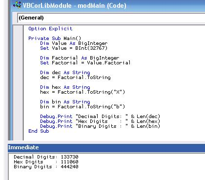



## BigMath 1\.1 \(updated July 8, 2007\)

### Description

This is a BigInteger class library for VB6! This implementation is modeled after the Java and Visual Studio 9 versions. It supports an unlimited number of digits, including negative values! The negative values use a Two's Complement representation, the same as VB6. All mathematical routines are supported, as well as bit manipulation and shifting! Factorial has been added in version 1.1. You can easily create a BigInteger from all standard integer datatypes, String, Double, Currency and Decimal types, too. It can parse decimal, hexidecimal, and binary strings and can generate the same numeric base output string types.

Working with extremely large integers has never been so easy in VB6.
 
### More Info
 

             |
---                |---
**Submitted On**   |2007-07-08 00:18:06
**By**             |[Kelly S\. Ethridge](https://github.com/Planet-Source-Code/PSCIndex/blob/master/ByAuthor/kelly-s-ethridge.md)
**Level**          |Advanced
**User Rating**    |4.9 (74 globes from 15 users)
**Compatibility**  |VB 6\.0
**Category**       |[Math/ Dates](https://github.com/Planet-Source-Code/PSCIndex/blob/master/ByCategory/math-dates__1-37.md)
**World**          |[Visual Basic](https://github.com/Planet-Source-Code/PSCIndex/blob/master/ByWorld/visual-basic.md)
**Archive File**   |[BigMath\_1\_207436782007\.zip](https://github.com/Planet-Source-Code/kelly-s-ethridge-bigmath-1-1-updated-july-8-2007__1-68710/archive/master.zip)

